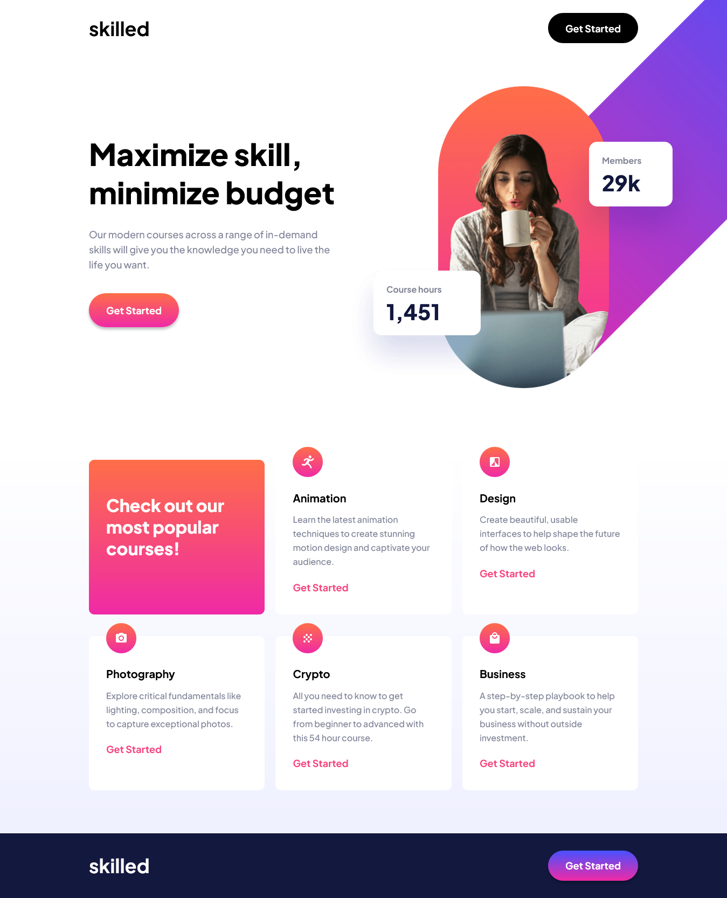

# Frontend Mentor - Skilled e-learning landing page solution

This is a solution to the [Skilled e-learning landing page challenge on Frontend Mentor](https://www.frontendmentor.io/challenges/skilled-elearning-landing-page-S1ObDrZ8q). Frontend Mentor challenges help you improve your coding skills by building realistic projects.

## Table of contents

- [Overview](#overview)
  - [The challenge](#the-challenge)
  - [Screenshot](#screenshot)
  - [Links](#links)
- [My process](#my-process)
  - [Built with](#built-with)
  - [What I learned](#what-i-learned)
  - [Continued development](#continued-development)
  - [Useful resources](#useful-resources)
- [Author](#author)

## Overview

### The challenge

Users should be able to:

- View the optimal layout depending on their device's screen size
- See hover states for interactive elements

### Screenshot



### Links

- Solution URL: [Add solution URL here](https://your-solution-url.com)
- Live Site URL: [Add live site URL here](https://skilled-elearning-landing-page.pages.dev/)

## My process

### Built with

- Semantic HTML5 markup
- CSS custom properties
- Flexbox
- Mobile-first workflow

### What I learned

For tablet and desktop screen sizes I set the image as a background with a specific position. However, I do not like the way it moves to the right while resizing the window past 1440px width. I would like to know if there is a better way to handle this. I am sure there is.

```css
body {
  background-image: url("../assets/image-hero-desktop@2x.png");
  background-position: right -336px top -154px;
  background-size: 1046px;
  background-repeat: no-repeat;
}
```

### Continued development

I have to get better at working with flexbox, background images and positioning.

### Useful resources

- [Example resource 1](https://www.w3schools.com/cssref/pr_background-position.asp) - This was useful to find the way to work with the image as a background.
- [Example resource 2](https://css-tricks.com/snippets/css/a-guide-to-flexbox/) - This is my go to guide to always refresh concepts to work with flexbox.

## Author

- Website - [Alvaro Salazar](https://alvaro-salazar.pages.dev/)
- Frontend Mentor - [@alvarolsr](https://www.frontendmentor.io/profile/alvarolsr)
- Twitter - [@alvarolsr](https://twitter.com/alvarolsr)
